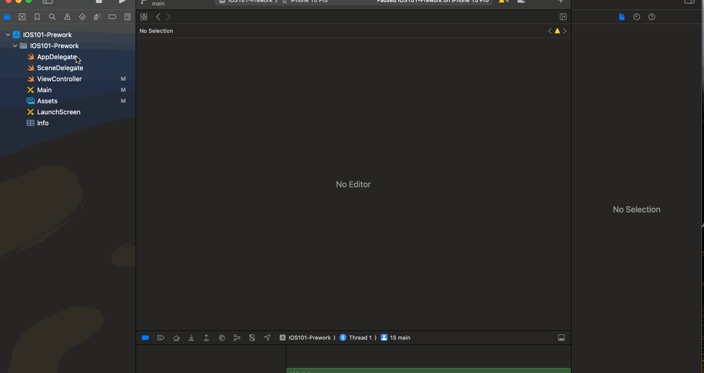

# Prework - *Simple Profile*

Submitted by: **Lee Mabhena**

**Simple profile** is an app that displays the profile of the user, particularly the name, school and intended career path. 

Time spent: **3** hours spent in total

## Required Features

The following **required** functionality is completed:

- [x] Users are see a screen with three labels and a button
- [x] Tapping the button changes the screen color to a random color
- [x] Added the user image

## Video Walkthrough

## Video Walkthrough

Here's a walkthrough of implemented user stories:

<!-- Replace this with whatever GIF tool you used! -->

GIF created with LiceCap

## App Brainstorming (Step 4)

1. Spotify

- Interactive Playlists: Dynamic playlist creation and personalized recommendations prominently displayed on the home screen.
- Visual Album View: A visually appealing album grid with cover art for easy navigation and exploration.
- Offline Mode Switch: Intuitive toggle switch on the main screen for quick access to offline listening.

2. Evernote

- Tag Sidebar: Visible sidebar showcasing tags, allowing for easy organization and quick access.
- Color-Coded Notebooks: Each notebook has a distinctive color, enhancing visual categorization.
- Floating Action Button (FAB): A prominent FAB for quick note creation, providing a seamless user experience.

3. Google Maps

- Real-Time Traffic Overlay: Live traffic updates visible on the map, with color-coded indications for congestion.
- Explore Nearby Places: Integration of a swipe-up panel for instant recommendations of nearby businesses and attractions.
- Offline Mode Widget: A resizable widget for one-tap access to offline maps, ensuring user convenience.

### App ideas

Create a rides app that allows for students without cars within the same campus to share and schedule rides with other students who have cars.

## Notes

Describe any challenges encountered while building the app.

## License

    Copyright [yyyy] [name of copyright owner]

    Licensed under the Apache License, Version 2.0 (the "License");
    you may not use this file except in compliance with the License.
    You may obtain a copy of the License at

        http://www.apache.org/licenses/LICENSE-2.0

    Unless required by applicable law or agreed to in writing, software
    distributed under the License is distributed on an "AS IS" BASIS,
    WITHOUT WARRANTIES OR CONDITIONS OF ANY KIND, either express or implied.
    See the License for the specific language governing permissions and
    limitations under the License.
